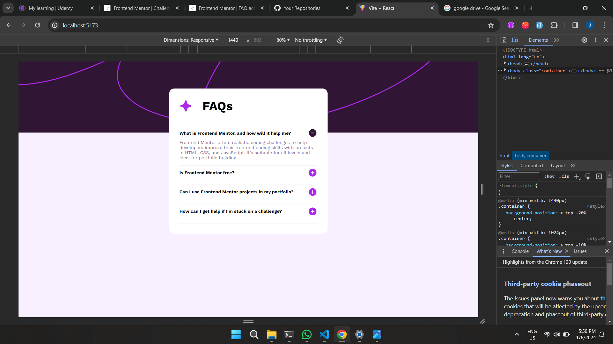
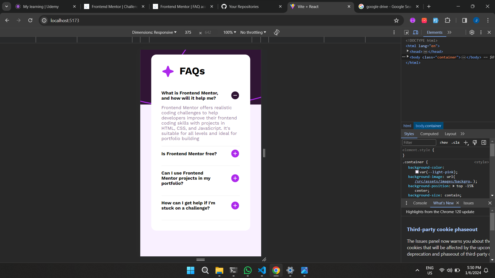

# Frontend Mentor - FAQ accordion solution

This is a solution to the [FAQ accordion challenge on Frontend Mentor](https://www.frontendmentor.io/challenges/faq-accordion-wyfFdeBwBz). Frontend Mentor challenges help you improve your coding skills by building realistic projects. 

### Screenshot

-- Desktop

-- Phone

### Links

- Solution: (https://github.com/guillermoanguiano/FAQ-accordion)
- Live Site URL: (https://lucent-nougat-53f41e.netlify.app/)
